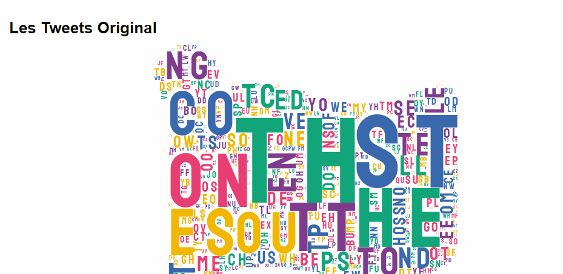

# lancer  Classification-des-Tweets sur mybinder

# Alors, que pouvons-nous apprendre de ce projet ?

Tout d'abord, le dernier cluster mentionné (le grand cluster indistinct) semble comprendre - entre autres choses - un mélange de chaînes vides
et de mots à basse fréquence qui n'étaient pas importants dans le modèle. C'est souvent le cas lorsqu'il s'agit de texte généré par l'utilisateur. Plus de données
 (plus d'utilisateurs observés) pourraient atténuer ce risque en donnant plus de signal à ces mots, mais il n'y a aucune garantie.

Deuxièmement, la gestion des caractères Unicode (éventuellement des caractères multi-octets) est importante! Rappelez-vous que nous avons supprimé la plupart des
 jetons de ponctuation de nos données avant d'ajuster un modèle - maintenant nous pouvons voir que nous ne l'avons fait que pour la ponctuation ASCII. En fonction
 des objectifs de votre modèle, il peut être utile de spécifier également une plage de caractères Unicode de valeur plus élevée à ajouter comme mots vides. 
Ou bien, gérez les caractères comme les emoji dans une étape spéciale de prétraitement.

